# StockFlow - Stock & Supplier Management


Sistema de gestión de inventario para tiendas electrónicas. Dashboard con métricas en tiempo real, gráficos interactivos, gestión de proveedores, productos y movimientos de stock. Desarrollado como proyecto de portfolio demostrando arquitectura limpia, código tipado y operaciones transaccionales.

## Screenshots

### Desktop

| Login | Registro |
|-------|----------|
| 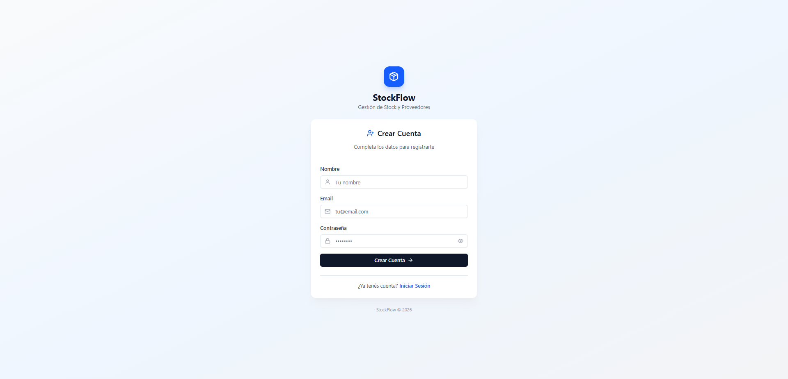 |  |

| Dashboard | Dashboard Métricas |
|-----------|-------------------|
| 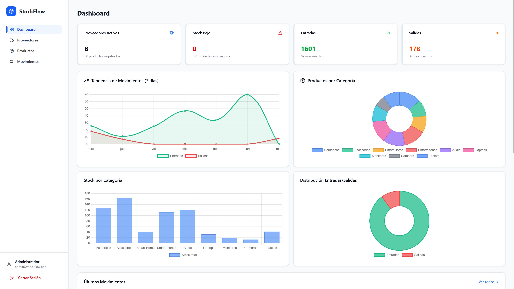 | 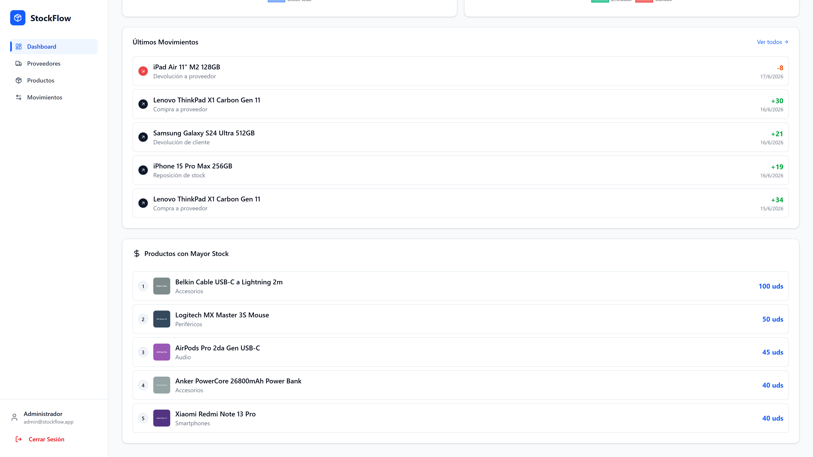 |

| Productos | Proveedores | Movimientos |
|-----------|-------------|-------------|
| 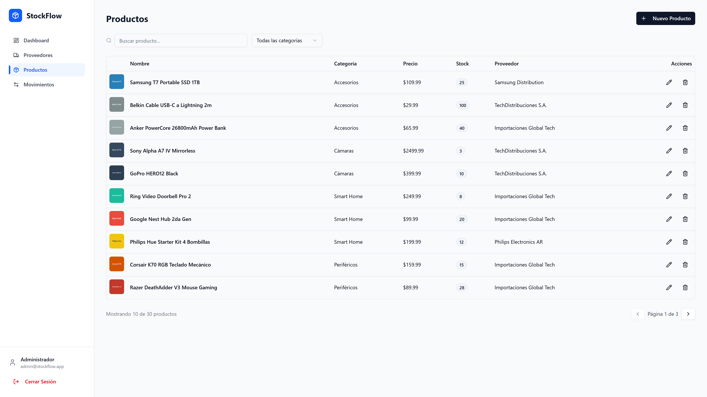 | 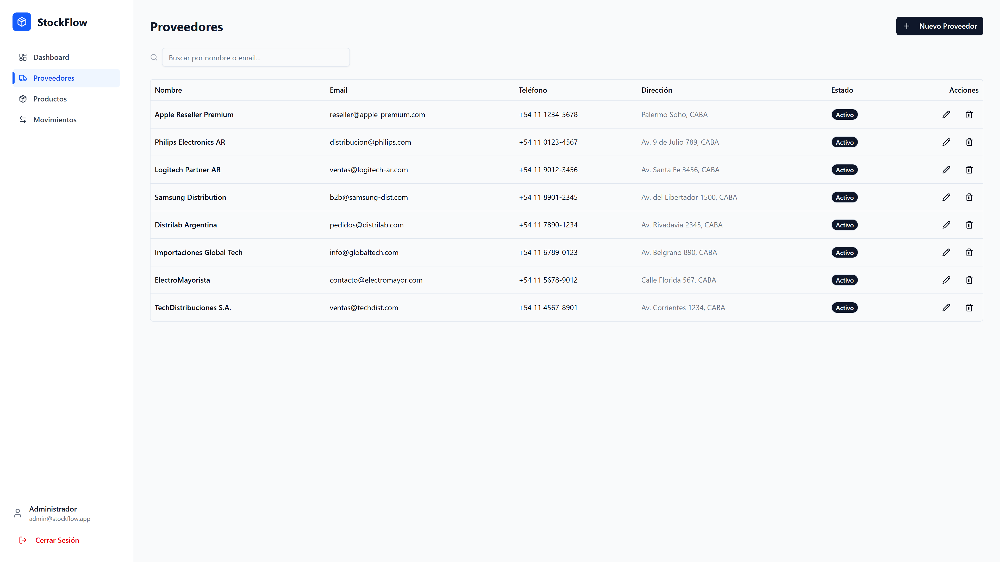 | 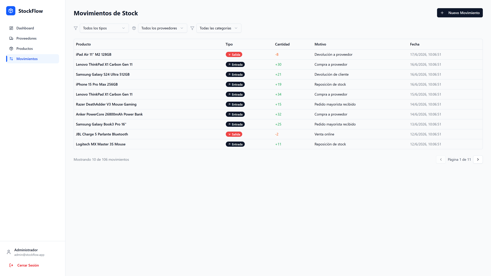 |

### Mobile

| Login | Dashboard | Productos |
|-------|-----------|-----------|
| 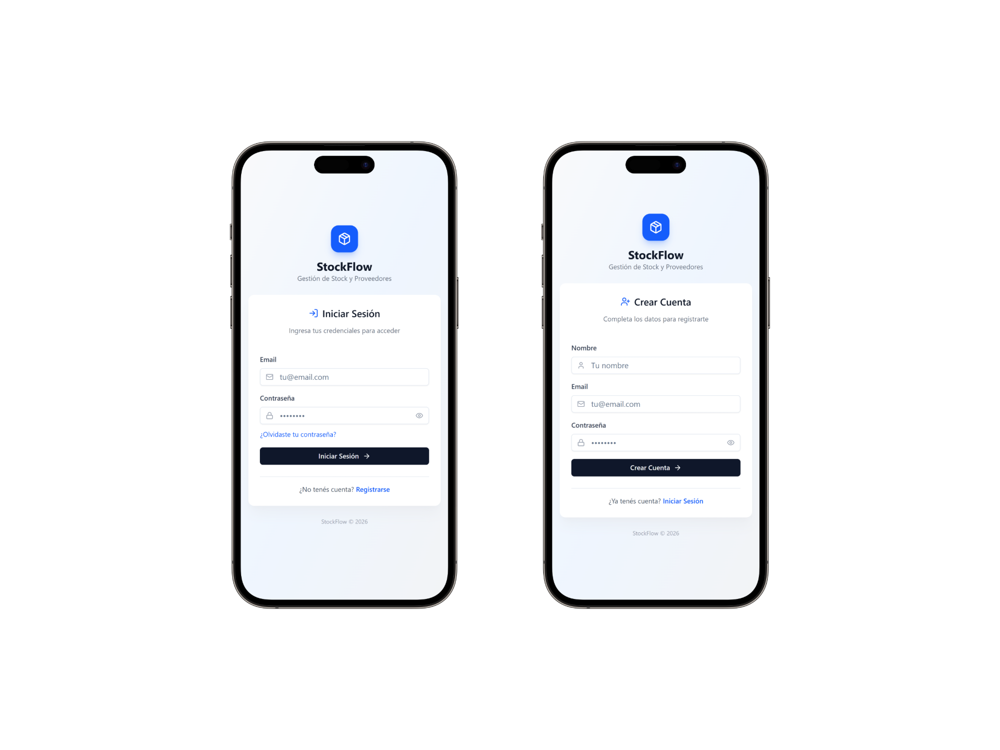 | 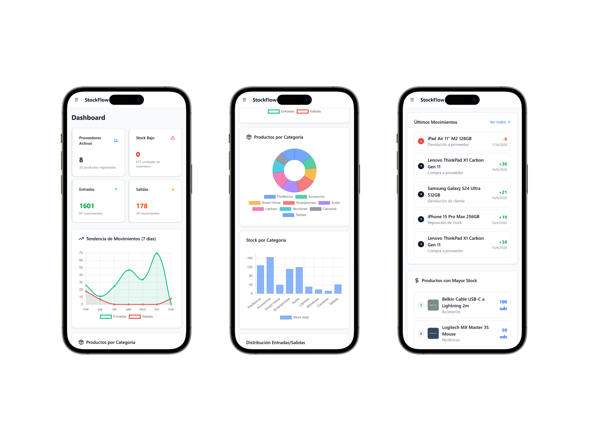 | 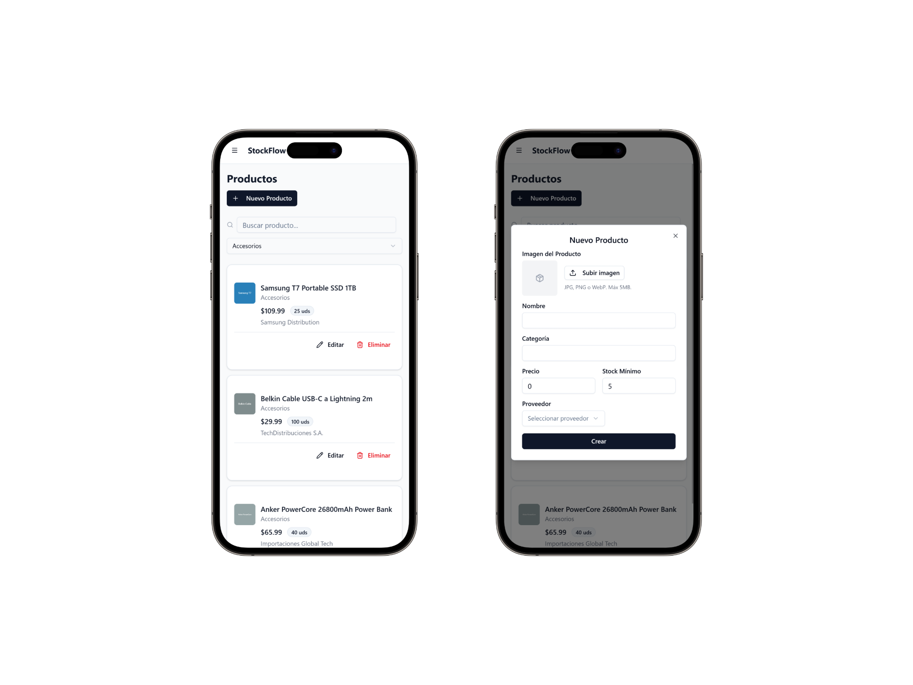 |

| Proveedores | Movimientos |
|-------------|-------------|
| 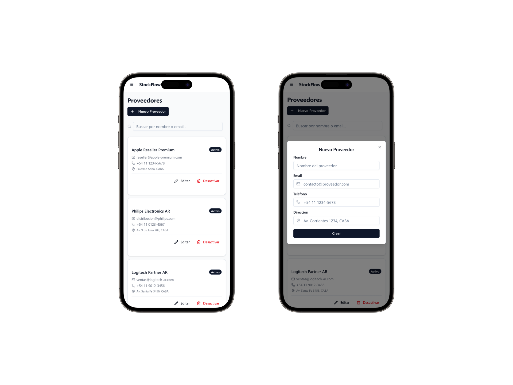 | 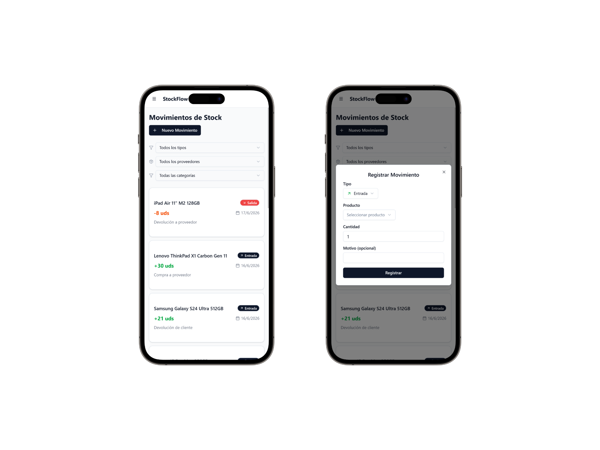 |

## Demo

- **Live Demo:** [https://mini-erp-demo.vercel.app](#)
- **API:** [https://mini-erp-api.onrender.com](#)
- **GitHub:** [https://github.com/NiicoVarelaa/Gestion-Stock-Proveedores](https://github.com/NiicoVarelaa/Gestion-Stock-Proveedores)

## Features

- **Dashboard interactivo** con 4 gráficos (tendencias, distribución por categoría, stock, entradas/salidas)
- **Métricas en tiempo real**: proveedores activos, stock bajo, unidades en inventario, valor total del inventario
- **Autenticación JWT** con cookies httpOnly y protección CSRF
- **CRUD completo** de Proveedores y Productos
- **Movimientos de stock** con transacciones ACID y aislamiento serializable
- **Imágenes de productos** con subida a Cloudinary y soporte de URL externa
- **Alertas de stock mínimo** en tiempo real
- **Diseño responsive** con sidebar colapsable en móvil
- **Validación end-to-end** con Zod
- **Seed de datos** realistas para demo (30 productos, 8 proveedores, 100+ movimientos, 1 admin)
- **Paginación persistente** que mantiene la página actual tras mutaciones
- **Recuperación de contraseña** con código por email (Gmail SMTP, expiración 10 min)
- **UX/UI mejorado**: iconos en formularios, tooltips, indicadores de paso, bordes de color en métricas

## Tech Stack

| Capa | Tecnología |
|------|-----------|
| Backend | Node.js, Express, TypeScript |
| Database | PostgreSQL |
| ORM | Prisma |
| Validation | Zod |
| Frontend | React 19, Vite, Tailwind, Shadcn UI |
| State | Zustand |
| Forms | React Hook Form + Zod |
| Charts | Chart.js + react-chartjs-2 |
| Notifications | Sonner |
| File Upload | Multer + Cloudinary |

## Arquitectura

```
Routes → Controllers → Services → Prisma Models
```

## Instalación Local

### Backend

```bash
cd backend
pnpm install
cp .env.example .env  # Configurar DATABASE_URL
npx prisma generate
npx prisma migrate dev
pnpm run prisma:seed  # Cargar datos de demo (admin: admin@stockflow.app / admin123)
pnpm run dev
```

### Frontend

```bash
cd frontend
pnpm install
cp .env.example .env
pnpm run dev
```

## Endpoints Principales

| Método | Endpoint | Descripción |
|--------|----------|-------------|
| POST | `/api/auth/register` | Registrar usuario |
| POST | `/api/auth/login` | Iniciar sesión |
| POST | `/api/suppliers` | Crear proveedor |
| GET | `/api/suppliers` | Listar proveedores |
| PUT | `/api/suppliers/:id` | Actualizar proveedor |
| PATCH | `/api/suppliers/:id/deactivate` | Desactivar proveedor |
| POST | `/api/products` | Crear producto |
| GET | `/api/products` | Listar productos |
| GET | `/api/products/low-stock` | Alertas stock bajo |
| POST | `/api/stock-movements` | Registrar movimiento (transaccional) |
| GET | `/api/stock-movements` | Historial de movimientos |
| GET | `/api/dashboard/metrics` | Métricas del dashboard |
| POST | `/api/auth/forgot-password` | Solicitar código de recuperación |
| POST | `/api/auth/verify-code` | Verificar código de recuperación |
| POST | `/api/auth/reset-password` | Restablecer contraseña |
| GET | `/api/auth/me` | Obtener usuario actual |
| POST | `/api/auth/logout` | Cerrar sesión |
| PATCH | `/api/products/:id/image` | Actualizar imagen de producto |

## Transacciones ACID

El registro de movimientos de stock utiliza `prisma.$transaction()` con aislamiento serializable para garantizar que la validación de stock, la creación del movimiento y la actualización del inventario sean atómicos. Si una operación falla, todas se revierten automáticamente.

```typescript
prisma.$transaction(async (tx) => {
  const product = await tx.product.findUnique({ where: { id: data.productId } });
  
  if (data.type === 'OUT' && product.stock < data.quantity) {
    throw new BusinessError('Stock insuficiente');
  }

  const [movement, updatedProduct] = await Promise.all([
    tx.stockMovement.create({ data }),
    tx.product.update({ where: { id }, data: { stock: newStock } }),
  ]);
}, { isolationLevel: Prisma.TransactionIsolationLevel.Serializable });
```

## Seguridad

- **Cookies httpOnly** con `sameSite: 'lax'` para protección CSRF
- **JWT** con secreto mínimo de 32 caracteres
- **Rate limiting** por IP en endpoints de autenticación y API
- **Helmet** para headers de seguridad HTTP
- **Validación Zod** en todos los inputs del backend
- **Password hashing** con bcrypt (mínimo 8 caracteres)
- **Variables de entorno** validadas al inicio del servidor

## Imágenes de Productos

Las imágenes de productos se pueden subir desde el formulario de creación/edición como archivo (JPG, PNG, WebP — máx 5MB) o pegando una URL externa.

### Almacenamiento con Cloudinary

1. Crear cuenta gratuita en [Cloudinary](https://cloudinary.com)
2. Copiar las credenciales del Dashboard (`Cloud name`, `API Key`, `API Secret`)
3. Agregar al `.env` del backend:
   ```env
   CLOUDINARY_CLOUD_NAME=tu-cloud-name
   CLOUDINARY_API_KEY=tu-api-key
   CLOUDINARY_API_SECRET=tu-api-secret
   ```
4. Si no se configuran variables de Cloudinary, se puede usar el campo `imageUrl` con una URL externa

### Fallback

Si un producto no tiene imagen, se muestra un placeholder con el icono `Package` en la tabla, alertas de stock bajo y dashboard.

## Estructura del Proyecto

```
mini-erp/
├── backend/
│   ├── src/
│   │   ├── config/          # Database, env validation, Cloudinary
│   │   ├── routes/          # Express routers
│   │   ├── controllers/     # Request handlers
│   │   ├── services/        # Business logic
│   │   ├── middlewares/     # Auth, validation, rate limiting
│   │   ├── utils/           # Custom error classes
│   │   ├── app.ts           # Express app setup
│   │   └── server.ts        # Entry point
│   ├── prisma/
│   │   ├── schema.prisma    # Data models (User, Supplier, Product, StockMovement, PasswordReset)
│   │   └── seed.ts          # Demo data seeder (electronics store)
│   └── package.json
├── frontend/
│   └── src/
│       ├── components/      # Reusable UI (Shadcn + custom)
│       ├── pages/           # Page components
│       ├── services/        # API client with interceptors
│       ├── store/           # Zustand stores
│       ├── types/           # TypeScript types
│       └── lib/             # Utilities
└── README.md
```

## Autor

[Nicolás Varela](https://github.com/NiicoVarelaa)

## Deploy

### Backend en Render

1. Crear un nuevo **Web Service** en [Render](https://render.com)
2. Conectar el repositorio de GitHub
3. Configurar:
   - **Root Directory:** `backend`
   - **Build Command:** `pnpm install && pnpm run build`
   - **Start Command:** `node dist/server.js`
4. Agregar variables de entorno:
   - `DATABASE_URL`: Tu conexión de PostgreSQL
   - `FRONTEND_URL`: La URL de tu frontend en Vercel
   - `JWT_SECRET`: Clave secreta de al menos 32 caracteres
   - `SMTP_USER`: Email de Gmail para envío de códigos de recuperación
   - `SMTP_PASS`: Contraseña de aplicación de Gmail (App Password)
   - `CLOUDINARY_CLOUD_NAME`: Cloud name de Cloudinary
   - `CLOUDINARY_API_KEY`: API Key de Cloudinary
   - `CLOUDINARY_API_SECRET`: API Secret de Cloudinary
5. Ejecutar migraciones y seed:
   ```bash
   npx prisma migrate deploy
   npx ts-node prisma/seed.ts
   ```
   El seed crea un usuario admin por defecto: `admin@stockflow.app` / `admin123`

### Frontend en Vercel

1. Importar el repositorio en [Vercel](https://vercel.com)
2. Configurar:
   - **Root Directory:** `frontend`
   - **Framework Preset:** Vite
   - **Build Command:** `pnpm install && pnpm run build`
   - **Output Directory:** `dist`
3. Agregar variable de entorno:
   - `VITE_API_URL`: La URL de tu backend en Render
